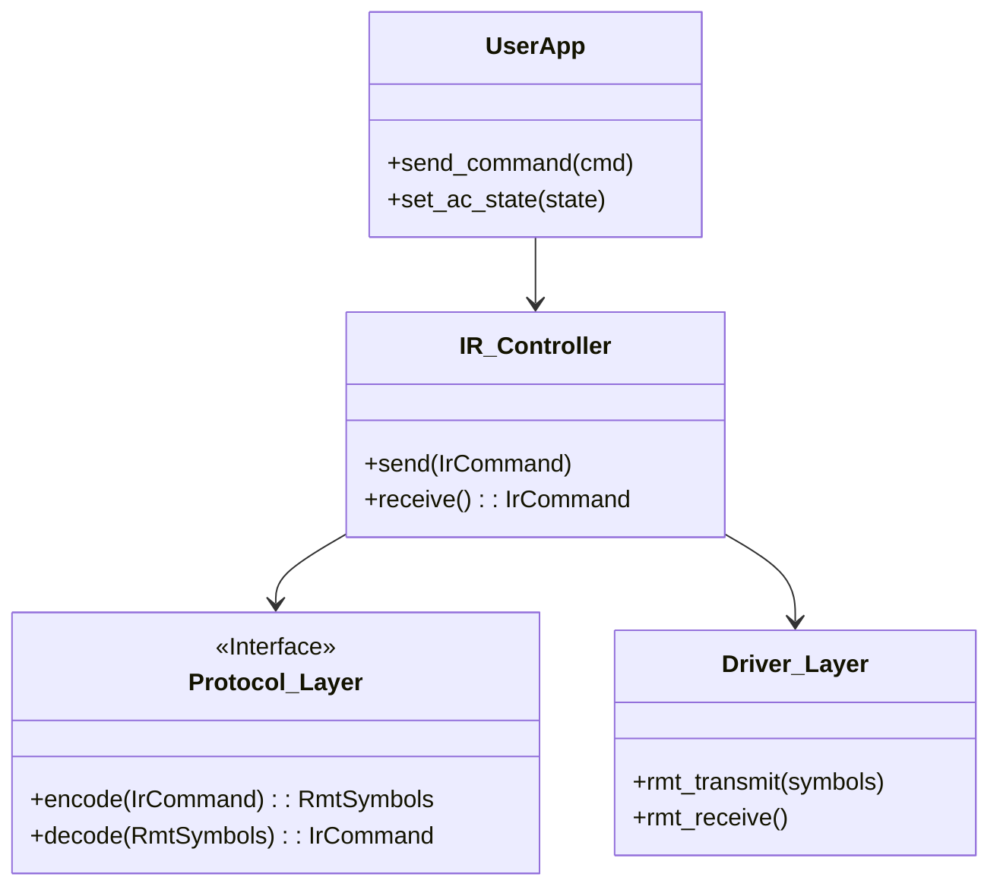

# ESP32 IR Engine Design (ESP-IDF Native)

## 1. Giới Thiệu
Tài liệu này đề xuất kiến trúc cho một IR Engine hiệu năng cao, native ESP-IDF, không phụ thuộc vào Arduino Core. Thiết kế tập trung vào sự `ổn định`, `tách biệt concerns`, và `tối ưu tài nguyên` cho các thiết bị IoT thương mại.

## 2. Phân Tích Protocol (Reference Extraction)

### 2.1 Common Protocols Reference
Dưới đây là thông số timing chuẩn của các giao thức phổ biến (38kHz carrier unless noted):

| Protocol | Header Mark | Header Space | Bit 0 (M/S) | Bit 1 (M/S) | Stop Bit | Payload Structure |
| :--- | :--- | :--- | :--- | :--- | :--- | :--- |
| **NEC** | 9000us | 4500us | 560 / 560us | 560 / 1690us | Yes | Address(8) + ~Addr(8) + Cmd(8) + ~Cmd(8) |
| **Samsung** | 4500us | 4500us | 560 / 560us | 560 / 1690us | Yes | 32-bit data block, requires correct footer |
| **Sony** (40kHz) | 2400us | 600us | 600 / 600us | 1200 / 600us | No | 12/15/20 bits. **Header is different logic**: Value determined by mark width |
| **RC5** (36kHz) | N/A | N/A | Manchester | Manchester | N/A | Manchester encoding (Logic level transitions) |

### 2.2 AC Protocols (State-based Complex Protocols)
Điều hòa (Daikin, Panasonic, LG) không gửi mã "lệnh" đơn giản. Chúng gửi **toàn bộ trạng thái** (Full State) mỗi lần bấm nút.

*   **Panasonic AC**: 
    *   Frame 1 (Header): 8 bytes cố định (Signature).
    *   Frame 2 (Data): 19 bytes chứa Power, Mode, Temp, Fan, Timer.
    *   *Timing*: Giống NEC nhưng header ngắn hơn (3500/1750us).
*   **Daikin**:
    *   Gồm nhiều frame (thường là 3 part). Part 1 header, Part 2 timer, Part 3 control.
    *   Checksum: Byte cuối cùng là tổng 8-bit của các byte trước đó.

## 3. Kiến Trúc IR Engine (Clean Architecture)

Hệ thống được chia thành 4 lớp rõ ràng:



### 3.1 Data Structures

#### Generic Command
```c
typedef struct {
    uint16_t protocol_id; // e.g., PROTOCOL_NEC, PROTOCOL_SAMSUNG
    uint64_t address;     // Device Address
    uint64_t command;     // Command Code
    uint16_t bits;        // Number of bits (e.g. 32 for NEC)
    bool repeat;          // Is repeat frame?
} key_command_t;
```

#### AC State (Semantic)
```c
typedef struct {
    bool power;
    uint8_t temp;       // 16-30
    uint8_t mode;       // Auto, Cool, Heat, Fan, Dry
    uint8_t fan;        // Auto, 1-5
    uint8_t swing_v;    // Vertical Swing
    uint8_t swing_h;    // Horizontal Swing
} ac_state_t;
```

## 4. Implementation Example (C++ & ESP-IDF 5.x)

Chúng ta sẽ triển khai **NEC Encoder** sử dụng `rmt_encoder_t` interface của ESP-IDF 5.x. Đây là cách làm chuẩn nhất, tận dụng hardware encoder của chip.

### 4.1 NEC Encoder (Header File)
`ir_nec_encoder.hpp`

```cpp
#pragma once

#include "driver/rmt_encoder.h"
#include <cstdint>

#define NEC_RESOLUTION_HZ 1000000 // 1MHz resolution (1us tick)

typedef struct {
    uint16_t address;
    uint16_t command;
} nec_payload_t;

// Factory function to create NEC Encoder
esp_err_t rmt_new_nec_encoder(rmt_encoder_handle_t *ret_encoder);
```

### 4.2 NEC Encoder (Implementation)
`ir_nec_encoder.cpp`

```cpp
#include "ir_nec_encoder.hpp"
#include <esp_log.h>
#include <cstring>
#include <stdlib.h>

static const char *TAG = "NEC_ENC";

// NEC Timings (in microseconds)
#define NEC_HEADER_MARK    9000
#define NEC_HEADER_SPACE   4500
#define NEC_BIT_MARK       560
#define NEC_ONE_SPACE      1690
#define NEC_ZERO_SPACE     560
#define NEC_STOP_BIT       560

typedef struct {
    rmt_encoder_t base;
    rmt_encoder_t *bytes_encoder; // Helper (if using bytes encoder internally)
    rmt_encoder_t *copy_encoder;
} rmt_nec_encoder_t;

static size_t rmt_encode_nec(rmt_encoder_t *encoder, rmt_channel_handle_t channel,
                             const void *primary_data, size_t data_size,
                             rmt_encode_state_t *ret_state) {
    rmt_nec_encoder_t *nec_encoder = __containerof(encoder, rmt_nec_encoder_t, base);
    const nec_payload_t *payload = (const nec_payload_t *)primary_data;
    
    // Check Args...
    
    // Prepare 32-bit Raw Frame: Address | ~Address | Command | ~Command
    uint32_t raw_data = 0;
    uint8_t addr_low = payload->address & 0xFF;
    uint8_t cmd_low = payload->command & 0xFF;
    
    // NEC Standard: LSB First implementation often simply effectively sends:
    // Addr (8) -> ~Addr (8) -> Cmd (8) -> ~Cmd (8)
    // We construct it bit by bit or byte by byte.
    
    // Let's create the RMT symbols manually for maximum control
    // Buffer size: Header(2) + 32 bits * 2 + Stop(1) = 67 items
    size_t num_symbols = 2 + 64 + 1; 
    rmt_symbol_word_t *symbols = (rmt_symbol_word_t *)malloc(num_symbols * sizeof(rmt_symbol_word_t));
    
    int idx = 0;
    
    // 1. Header
    rmt_symbol_word_t header = {{{
        .bit_time = NEC_HEADER_MARK, .level = 1,
    }, {
        .bit_time = NEC_HEADER_SPACE, .level = 0,
    }}};
    symbols[idx++] = header;

    // 2. Data Bits (32 bits total)
    // Structure: Low byte Addr, High Byte Addr (inverted), Low byte Cmd, High Byte Cmd (inverted)
    uint8_t bytes[4];
    bytes[0] = addr_low;
    bytes[1] = ~addr_low;
    bytes[2] = cmd_low;
    bytes[3] = ~cmd_low;

    for (int b = 0; b < 4; b++) {
        uint8_t val = bytes[b];
        for (int i = 0; i < 8; i++) {
            bool is_one = (val >> i) & 1; // LSB First
            
            rmt_symbol_word_t bit_item = {{{
                .bit_time = NEC_BIT_MARK, .level = 1,
            }, {
                .bit_time = (uint16_t)(is_one ? NEC_ONE_SPACE : NEC_ZERO_SPACE), .level = 0,
            }}};
            symbols[idx++] = bit_item;
        }
    }

    // 3. Stop Bit
    // Just a mark to terminate space
    rmt_symbol_word_t stop = {{{
        .bit_time = NEC_STOP_BIT, .level = 1,
    }, {
        .bit_time = 0, .level = 0, // Padding
    }}};
    symbols[idx++] = stop; // Important: Last symbol handles end of transmission

    // Send using RMT
    // Note: In a real encoder, we return size and let the driver handle the memory or session.
    // However, rmt_transmit expects the encoder to 'encode' into the channel's memory.
    // ESP-IDF 5's Encoder callback is meant to yield symbols.
    
    // For simplicity in this demo, let's assume we return symbols to session.
    *ret_state = RMT_ENCODING_COMPLETE;
    return num_symbols; // Need to verify API specifics for memory passing vs streaming
}
// ... (Cleanup and Constructor omitted for brevity)
```

**Lưu ý**: Trong ESP-IDF 5.x, `rmt_transmit` thường dùng `copy_encoder` cho raw symbols hoặc `bytes_encoder` cho các protocol đơn giản. Việc viết custom encoder class như trên cho phép bạn xử lý logic phức tạp (như state machine của điều hòa) ngay tại tầng driver.

## 5. Chiến Lược Database (Storage Strategy)

Để tối ưu giữa RAM, Flash và tính linh hoạt:

### 5.1 Hybrid Storage Model

1.  **Common Protocols (TV, Fan)**:
    *   Sử dụng **Compile-time Structs**.
    *   Lý do: Timing cố định, payload nhỏ. Không tốn RAM runtime, nằm trong Flash `.rodata`.

2.  **State-based ACs (Daikin, LG)**:
    *   Sử dụng **Code-based Generators** (Logic Factory).
    *   Thay vì lưu bảng lookup khổng lồ cho mọi nhiệt độ, ta viết hàm C:
        ```c
        void make_daikin_frame(ac_state_t state, uint8_t *out_buf) {
             out_buf[5] = map_temp(state.temp);
             out_buf[6] = map_mode(state.mode);
             out_buf[18] = calc_checksum(out_buf, 18);
        }
        ```
    *   Ưu điểm: Cực nhẹ (< 1KB code so với hàng chục KB lookup table).

3.  **Learned Codes (Raw)**:
    *   Lưu trong **NVS hoặc LittleFS** dưới dạng nén (RLE hoặc Palette-based như đã phân tích trước đó).
    *   Lý do: Dữ liệu động, do user thêm vào.

## 6. Luồng Hoạt Động (Runtime Flow)

### 6.1 Receive (RX) Flow
1.  **RMT Driver**: Nhận chuỗi symbols (pulse/space stream) vào ring buffer.
2.  **Noise Filter**: Bỏ qua các chuỗi quá ngắn (< 10 transition).
3.  **Protocol Matcher**:
    *   Duyệt qua danh sách Protocol Decoders đã đăng ký (NEC, Sony...).
    *   Decoder kiểm tra Header -> Timing -> Decode Bits -> Checksum.
    *   Nếu khớp: Trả về `IrCommand`.
4.  **Raw Fallback**:
    *   Nếu không khớp protocol nào và đang ở chế độ "Learning", lưu raw symbols vào buffer để nén.

### 6.2 Transmit (TX) Flow
1.  **Application**: Gọi `send_ac_temp(24)`.
2.  **Controller**:
    *   Cập nhật `current_ac_state.temp = 24`.
    *   Tìm "Protocol Generator" cho Model điều hòa hiện tại (ví dụ: `gen_daikin_protocol`).
3.  **Generator**: Tạo ra mảng byte raw (e.g. 19 bytes).
4.  **Encoder**:
    *   Chuyển mảng byte -> RMT Symbols dựa trên timing protocol (Daikin timing).
5.  **RMT Driver**: Bắn tín hiệu ra LED hồng ngoại qua GPIO.

## 7. Phân Tích Trade-off & Unit Test

### 7.1 Tại sao không dùng Raw cho tất cả?
| Tiêu chí | Protocol-based (Generated) | Raw (Learned) |
| :--- | :--- | :--- |
| **Độ chính xác** | Tuyệt đối (Computed timing) | Tương đối (Phụ thuộc nhiễu lúc học) |
| **Bộ nhớ** | Rất thấp (Logic code) | Rất cao (Lưu mẫu cho TỪNG nhiệt độ/chế độ) |
| **Tính năng** | Chỉnh được nhiệt độ bất kỳ | Chỉ phát lại đúng cái đã học |
| **Kết luận** | Dùng cho thiết bị chính hãng | Dùng fallback cho thiết bị lạ |

### 7.2 Unit Testing
Với kiến trúc ESP-IDF, ta có thể viết Unit Test chạy trên PC (Linux host test) hoặc on-chip:

```cpp
void test_nec_encoding() {
    nec_payload_t cmd = { .address=0x04, .command=0xCF };
    rmt_symbol_word_t buffer[100];
    
    // Encode simulated
    size_t count = simulate_nec_encode(cmd, buffer);
    
    // Verify Header
    TEST_ASSERT_EQUAL(9000, buffer[0].val.bit_time); 
    TEST_ASSERT_EQUAL(4500, buffer[1].val.bit_time);
    
    // Verify Address (0x04 -> 00000100 -> LSB first sequence)
    // ... logic verify bit timings
}
```
Mã này đảm bảo logic timing đúng tuyệt đối trước khi đụng vào phần cứng.
